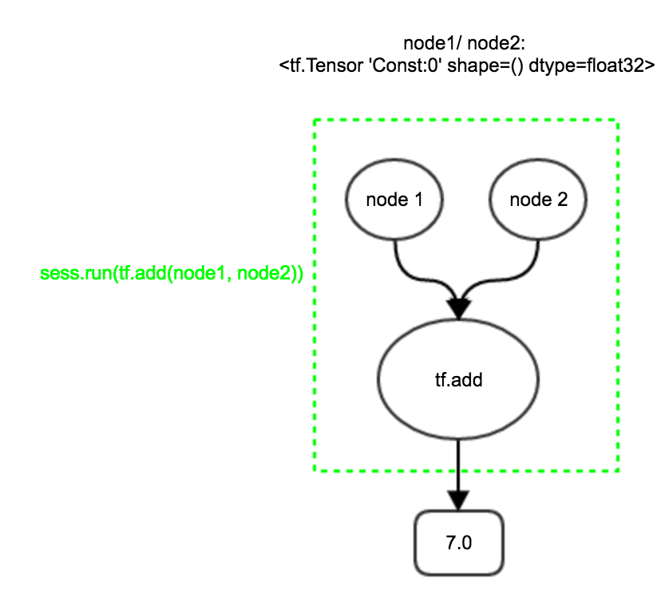
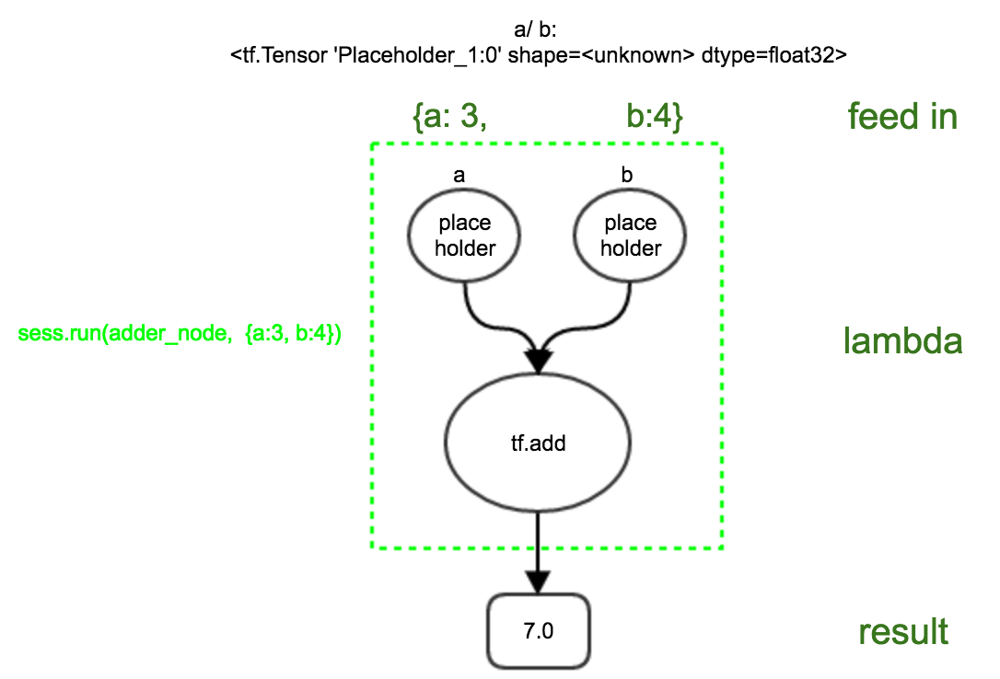
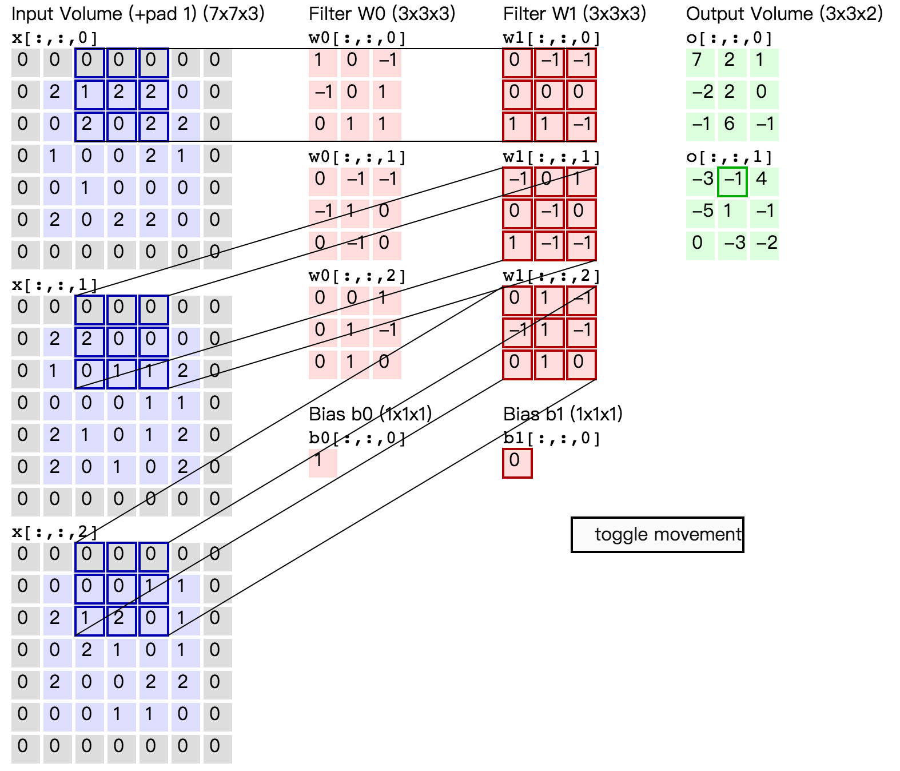

# A Whirlwind Tour Through TensorFlow

By TianJun(tianjun.cpp@gmail.com)


```python
In [1]: import tensorflow as tf

In [2]: tf.__version__
Out[2]: '1.0.0'
```


## Tensors

```python
# a rank 0 tensor; this is a scalar with shape []
3

# a rank 1 tensor; this is a vector with shape [3]
[1. ,2., 3.]

# a rank 2 tensor; a matrix with shape [2, 3]
[[1., 2., 3.],
 [4., 5., 6.]] 

# a rank 3 tensor with shape [2, 1, 3]
[[[1., 2., 3.]], 
 [[7., 8., 9.]]] 
```


## Session

A `Session` object encapsulates the environment in which `Operation`
objects are executed, and `Tensor` objects are evaluated.


`Session.run()`

The `run` method of a Session object will run one "step" of TensorFlow operation.

Note: Remeber to call close method to release resource. Usually we use with expression
to close automatically.


Session with constant as input:
```python
node1 = tf.constant(3.0, tf.float32)
node2 = tf.constant(4.0) # also tf.float32 implicitly
sess.run(node1 + node2)
```


</img>


Session with placeholder:
```python
a = tf.placeholder(tf.float32)
b = tf.placeholder(tf.float32)
adder_node = a + b 
sess.run(adder_node, {a: 3, b:4.5})
```





Mixed with Variable:

```python
W = tf.Variable([.3], tf.float32)
b = tf.Variable([-.3], tf.float32)
x = tf.placeholder(tf.float32)
linear_model = W * x + b
# initial variables
init = tf.global_variables_initializer()
sess.run(init)

sess.run(linear_model, {x:[1,2,3,4]})
```

The `Variable()` constructor requires an initial value which defines the
type and shape of the variable. After construction, the type and shape of
the variable are fixed. 


The value of variable can be changed like:

```python
# Assign a new value to the variable with `assign()` or a related method.
W_update = W.assign(W + 1.0)  # equal to W.assign_add([1])
sess.run(W)  # array([ 0.30000001], dtype=float32)
sess.run(W_update)  # array([ 1.29999995], dtype=float32)
sess.run(W)  # array([ 1.29999995], dtype=float32)

for _ in range(3):
    sess.run(W_update)

sess.run(W)  # array([ 4.30000019], dtype=float32)

# Notice the type
type(W_update)  # tensorflow.python.framework.ops.Tensor
```


## Optimizer

Take the GradientDescentOptimizer as an example:
```python
W = tf.Variable([.3], tf.float32)
b = tf.Variable([-.3], tf.float32)
x = tf.placeholder(tf.float32)
linear_model = W * x + b
y = tf.placeholder(tf.float32)
loss = tf.reduce_sum( tf.square(linear_model - y))

init = tf.global_variables_initializer()
sess.run(init)
optimizer = tf.train.GradientDescentOptimizer(0.01)
train = optimizer.minimize(loss)

type(train)  # tensorflow.python.framework.ops.Operation

sess.run(train, {x:[1,2,3,4], y:[0,-1,-2,-3]})
sess.run([W, b])
# [array([-0.21999997], dtype=float32), array([-0.456], dtype=float32)]

sess.run(train, {x:[1,2,3,4], y:[0,-1,-2,-3]})
sess.run([W, b])
# [array([-0.39679998], dtype=float32), array([-0.49552], dtype=float32)]
```


In general, optimizers are used to compute gradients for a loss and apply gradients to variables.

Check out more [optimizers](https://www.tensorflow.org/api_guides/python/train)


## A Simple DenseLayer

```python
# prepare data
from tensorflow.examples.tutorials.mnist import input_data
mnist = input_data.read_data_sets("MNIST_data/", one_hot=True)

# the first dimension of input(sample size) is left unknown here
x = tf.placeholder(tf.float32, [None, 784])  
W = tf.Variable(tf.zeros([784, 10]))
b = tf.Variable(tf.zeros([10]))
y = tf.matmul(x, W) + b
y_ = tf.placeholder(tf.float32, [None, 10])

cross_entropy = tf.reduce_mean(tf.nn.softmax_cross_entropy_with_logits(labels=y_, logits=y))
train_step = tf.train.GradientDescentOptimizer(0.5).minimize(cross_entropy)

# initial variables
sess = tf.InteractiveSession()
tf.global_variables_initializer().run()

# Train
for _ in range(1000):
    batch_xs, batch_ys = mnist.train.next_batch(100)
    sess.run(train_step, feed_dict={x: batch_xs, y_: batch_ys})

# Test trained model
correct_prediction = tf.equal(tf.argmax(y, 1), tf.argmax(y_, 1))
accuracy = tf.reduce_mean(tf.cast(correct_prediction, tf.float32))
print(sess.run(accuracy, feed_dict={x: mnist.test.images, y_: mnist.test.labels}))
```


## Cross-Entropy

$$H_{y'}(y) = -\sum_i y'_i \log(y_i)$$


## Convolution
Here I take the example in [cs231](http://cs231n.github.io/convolutional-networks/) 
to demonstrate how to use `tf.nn.conv2d`.





```python
import tensorflow as tf
import tensorlayer as tl
import numpy as np

ft = [1, 0, -1, -1, 0, 1, 0, 1, 1,    # w0[:,:,0]
      0, -1, -1, 0, 0, 0, 1, 1, -1,   # w1[:,:,0]      
      0, -1, -1, -1, 1, 0, 0, -1, 0,  # w0[:,:,1]
      -1, 0, 1, 0, -1, 0, 1, -1, -1,  # w1[:,:,1]
      0, 0, 1, 0, 1, -1, 0, 1, 0,     # w0[:,:,2]
      0, 1, -1, -1, 1, -1, 0, 1, 0    # w1[:,:,2]
     ]
ft = np.array(ft, dtype=np.float32).reshape([3,2,3,3]).transpose([2,3,0,1])
ft.shape  # (3, 3, 3, 2) [filter_height, filter_width, in_channels, out_channels]
ft[:,:,1,1]  # array([[-1.,  0.,  1.], [ 0., -1.,  0.], [ 1., -1., -1.]], dtype=float32)

filters = tf.Variable(ft)
sess.run(tf.global_variables_initializer())

inputs = [[[2,1,2,2,0,0,2,0,2,2,1,0,0,2,1,0,1,0,0,0,2,0,2,2,0],
          [2,2,0,0,0,1,0,1,1,2,0,0,0,1,1,2,1,0,1,2,2,0,1,0,2],
          [0,0,0,1,1,2,1,2,0,1,0,2,1,0,1,2,0,0,2,2,0,0,1,1,0]]]
inputs = np.array(inputs, dtype=np.float32).reshape([1,3,5,5]).transpose([0,2,3,1])

inputs_ph = tf.placeholder(tf.float32, shape=[1,5,5,3])
res = sess.run(tf.nn.conv2d(inputs_ph, filters, strides=[1,2,2,1], padding='SAME'), 
          feed_dict={inputs_ph:inputs})

res.shape  #(1, 3, 3, 2) [batch, in_height, in_width, in_channels]

res[:,:,:,0]  #array([[[ 6.,  1.,  0.], [-3.,  1., -1.], [-2.,  5., -2.]]], dtype=float32)
```


## padding

The difference is detailed [here](http://stackoverflow.com/questions/37674306/).

- `SAME`. Pad with zero so that the output size is the same than input size.

- `VALID`. Filter window stays at valid position inside input map. So output size shrinks by filter_size - 1


## strides

`strides` specify the stride of filter in both height and width direction.

```python
strides = [1, stride_in_height, stride_in_width, 1]
```


## backpropagation

See [Backpropagation In Convolutional Neural Networks](http://www.jefkine.com/general/2016/09/05/backpropagation-in-convolutional-neural-networks/)


## Take a deep breath

With all the knowledges above, you can easily understand the
[Deep MNIST for Experts](https://www.tensorflow.org/get_started/mnist/pros).
However, some obstacles are still lying there.


## Get familiar with your hammer

Go through the [Python API Guides](https://www.tensorflow.org/api_guides/python/)


## A complete example

[TensorFlow and deeplearning - without a PhD](https://gotocon.com/dl/goto-london-2016/slides/MartinGorner_TensorflowAndDeepLearningWithoutAPhD.pdf)


## Missing Topics

- [awesome-tensorflow](https://github.com/jtoy/awesome-tensorflow#libraries)


## More

- [TensorLayer](https://github.com/zsdonghao/tensorlayer)
- [Edward](https://github.com/blei-lab/edward)
